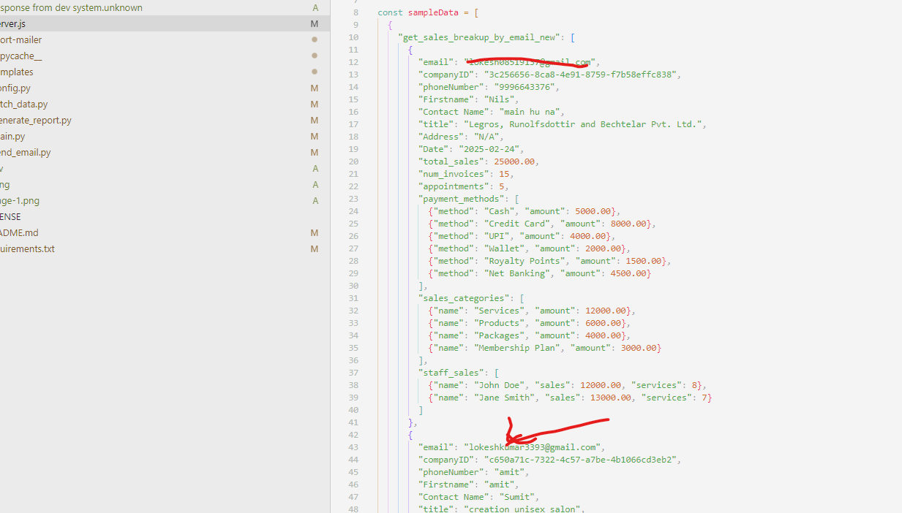
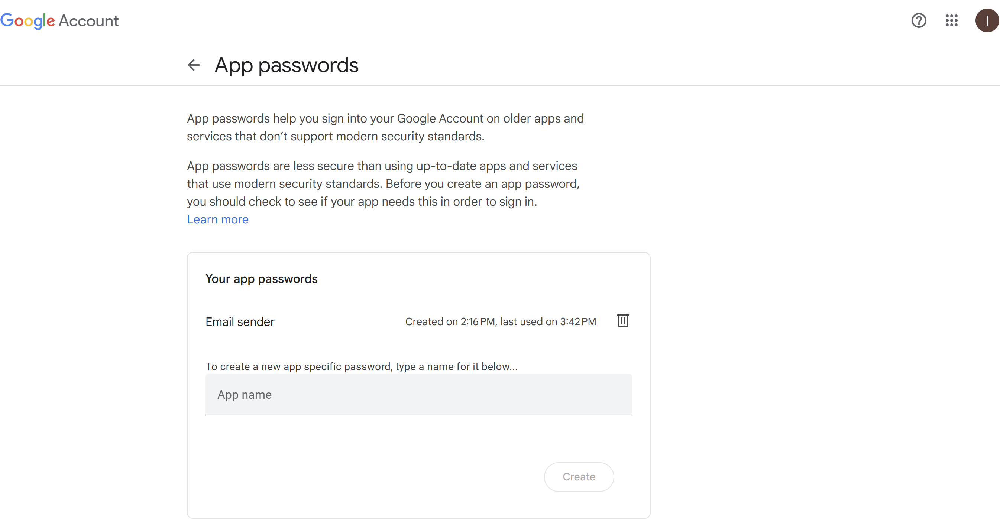
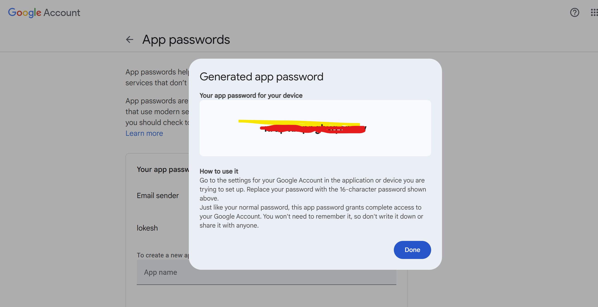

# 🚀 Daily Report Mailer

A simple automation script to send daily reports via email.

## 📌 Steps to Set Up and Run

### **Step 1: Start the API Server**
1. Open the `apiserver` folder.
2. Run the following commands:
   ```sh
   npm install
   nodemon server.js
   ```
3. Open the `apiserver\server.js`  add your email to get report 
   ⚠ **Note:** The `apiserver` provided is a trial API made for testing purposes. You should use your own API when configuring `report-mailer`.


### **Step 2: Configure Email Settings**
- Modify `.env ` in `report-mailer` to:
  - Set the **GMAIL USER**.#from which email you want to send reports to the client 
  -Set the **GMAIL APP PASSWORD**.
      To get an App Password:
         1. Go to your Google Account settings (from which you want to send the reports to the client)
         2. Enable 2-Step Verification if not already enabled
         3. https://support.google.com/accounts/answer/185833?hl=en     go on this url 
         4. Click on **Create and manage your app passwords**  after login in you will reach here 
         5. Write your App name and Click on **Create** you will get this  which is app password 
    
  - Configure the **API endpoint** for email dispatch.

### **Step 3: Run the Report Mailer**
1. Open the `report-mailer` folder.
2. Install dependencies and start the script:
   ```sh
   pip install -r requirements.txt
   python main.py
   
